# Star Cities Data Model


## 1. Tables

### Table: `user_profiles`
Publicly visible profile information for each user.
- **Fields**:
    - `id`: UUID (Primary Key, references `auth.users.id`)
    - `username`: TEXT (Unique)
    - `created_at`: TIMESTAMPTZ
    - `updated_at`: TIMESTAMPTZ

### Table: `games`
The primary record for a game instance.
- **Fields**:
    - `id`: UUID (Primary Key)
    - `status`: `game_status` (`WAITING | STARTING | PLANNING | RESOLVING | FINISHED`)
    - `turn_number`: Integer (Default 1)
    - `player_count`: Integer (Default 4)
    - `stars`: JSONB (`[{x, y}]` coordinates list)
    - `game_parameters`: JSONB (the game parameters JSON schema)
    - `winner`: UUID (Foreign Key to `players.id`, null if no winner)
    - `created_at`: TIMESTAMPTZ
    - `updated_at`: TIMESTAMPTZ

### Table: `players`
Links users or bots to games and assigns their faction.
- **Fields**:
    - `id`: UUID (Primary Key)
    - `game_id`: UUID (Foreign Key to `games`)
    - `user_id`: UUID (Foreign Key to auth users, null if `is_bot` is true)
    - `is_bot`: Boolean (Default FALSE)
    - `bot_name`: TEXT (Friendly name for the bot, null for human players)
    - `faction`: `faction` (`RED | YELLOW | GREEN | CYAN | BLUE | MAGENTA`)
    - `home_star`: JSONB (`{x, y}` coordinates)
    - `is_ready`: Boolean (Default FALSE)
    - `is_eliminated`: Boolean (Default FALSE)
    - `eliminated_on_turn`: Integer (Null if not eliminated)
    - `is_winner`: Boolean (Default FALSE)
- **Constraints**:
    - `player_identity`: Ensure either `user_id` is present OR `is_bot` is true.
    - `idx_unique_human_player_per_game`: A real user can only join a game once.
    - `UNIQUE(game_id, faction)`: Each faction is assigned once per game.

### Table: `turn_states`
Records the starting position of all pieces for a given turn.
- **Created by**: The Server (at the end of resolution for the *next* turn).
- **Fields**:
    - `id`: UUID (Primary Key)
    - `game_id` UUID
    - `turn_number` Integer
    - `state` (JSONB)
    - `created_at` TIMESTAMPTZ
- **Constraints**:
    - `UNIQUE(game_id, turn_number)`: Only one state snapshot per turn.

### Table: `turn_planned_actions`
Records the intents submitted by players during the planning phase.
- **Created by**: The Client (one row per player, per turn).
- **Fields**:
    - `id`: UUID (Primary Key)
    - `game_id` UUID
    - `turn_number` Integer
    - `player_id` UUID
    - `actions` (JSONB)
    - `submitted_at` TIMESTAMPTZ
- **Constraints**:
    - `UNIQUE(game_id, player_id, turn_number)`: Each player can only have one set of planned actions per turn.

### Table: `turn_events`
Records the resolved outcomes that occurred during the transition between turns.
- **Created by**: The Server (once all players are ready or timer expires).
- **Fields**:
    - `id`: UUID (Primary Key)
    - `game_id` UUID
    - `turn_number` Integer
    - `events` (JSONB)
    - `created_at` TIMESTAMPTZ
- **Constraints**:
    - `UNIQUE(game_id, turn_number)`: Only one set of events per turn.

---

## 2. JSON Schemas: 

## Game Parameters

```json
{
  "grid_size": 9,
  "star_count": 6,
  "star_count_to_win": 3,
  "max_ships_per_city": 5,
  "starting_ships": ["NEUTRINO", "NEUTRINO", "PARALLAX", "ECLIPSE"]
}
```

### Turn State
The `state` field in `turn_states` is a list of piece objects.
```json
{
  "id": "UUID",
  "faction": "RED | YELLOW | GREEN | CYAN | BLUE | MAGENTA",
  "type": "STAR_CITY | NEUTRINO | ECLIPSE | PARALLAX",
  "x": 0,         // 0-8, null if in tray
  "y": 0,         // 0-8, null if in tray
  "tether_id": "UUID", // ID of the Star City this ship is tethered to
  "is_anchored": false,
  "is_visible": true,
  "is_in_tray": false
}
```

### Turn Planned Actions
The `actions` field in `turn_planned_actions` is a list of action objects.

```json
[
  {
    "type": "MOVE_ACT",
    "piece_id": "UUID",
    "to": { "x": 2, "y": 3 }
  },
  {
    "type": "BOMBARD_ACT",
    "piece_id": "UUID",
    "target_id": "UUID"
  },
  {
    "type": "TETHER_ACT",
    "ship_id": "UUID",
    "city_id": "UUID"
  },
  {
    "type": "ANCHOR_ACT",
    "piece_id": "UUID",
    "is_anchored": true
  },
  {
    "type": "PLACE_ACT",
    "tray_piece_id": "UUID",
    "city_id": "UUID",
    "target": { "x": 1, "y": 2 }
  }
]
```

### Turn Events
The `events` field in `turn_events` is a list of event objects. The server generates these in a specific order for the client to "replay" (e.g., Bombardments first, then Moves, etc.).

```json
[
  {
    "type": "MOVE",
    "faction": "RED",
    "piece_id": "UUID",
    "from": { "x": 1, "y": 3 },
    "to": { "x": 2, "y": 3 },
  },
  {
    "type": "TETHER",
    "faction": "RED",
    "ship_id": "UUID",
    "city_id": "UUID"
  },
  {
    "type": "ANCHOR",
    "faction": "RED",
    "piece_id": "UUID",
    "is_anchored": true
  },
  {
    "type": "PLACE",
    "faction": "RED",
    "tray_piece_id": "UUID",
    "city_id": "UUID",
    "target": { "x": 1, "y": 2 }
  },
  {
    "type": "BOMBARD",
    "coord": { "x": 4, "y": 4 },
    "attacking_pieces": [
      { "piece_id": "UUID", "piece_type": "ECLIPSE", "faction": "RED" }
      { "piece_id": "UUID", "piece_type": "ECLIPSE", "faction": "RED" }
    ],
    "target": { "piece_id": "UUID", "piece_type": "PARALLAX", "faction": "BLUE" },
    "attack_strength": 4,
    "target_strength": 6,
    "is_destroyed": false
  },
  {
    "type": "SHIP_LOST_TETHER",
    "faction": "RED",
    "piece_id": "UUID",
  },
  {
    "type": "BATTLE_COLLISION",
    "coord": { "x": 3, "y": 3 },
    "entering_participants": [
      { "piece_id": "UUID", "piece_type": "PARALLAX", "faction": "BLUE" },
      { "piece_id": "UUID", "piece_type": "ECLIPSE", "faction": "RED" }
    ],
    "defending_participant": null,
    "supporting_participants": [
      { "piece_id": "UUID", "piece_type": "PARALLAX", "faction": "BLUE" },
      { "piece_id": "UUID", "piece_type": "STAR_CITY", "faction": "RED" },
      { "piece_id": "UUID", "piece_type": "NEUTRINO", "faction": "RED" }
    ],
    "supporting_bombardments": [
      { "piece_id": "UUID", "piece_type": "ECLIPSE", "faction": "RED" }
    ]
    "calculated_strengths": [
      {"faction": "BLUE", "strength": 9.0 },
      {"faction": "RED", "strength": 11.0 },
    ],
    "winning_faction": "BLUE",
    "result": "CAPTURE | DESTROY"
  },
  {
    "type": "PIECE_ACQUIRED",
    "faction": "RED",
    "piece_type": "ECLIPSE",
    "new_piece_id": "UUID"
  },
  {
    "type": "CITY_CAPTURED",
    "city_id": "UUID",
    "from_faction": "RED",
    "to_faction": "BLUE"
  },
  {
    "type": "SHIP_DESTROYED_IN_BATTLE",
    "piece_id": "UUID", 
    "piece_type": "PARALLAX", 
    "faction": "BLUE"
  },
  {
    "type": "SHIP_DESTROYED_IN_BOMBARDMENT",
    "piece_id": "UUID", 
    "piece_type": "PARALLAX", 
    "faction": "BLUE"
  },
  {
    "type": "FACTION_ELIMINATED",
    "faction": "RED"
  },
  {
    "type": "GAME_OVER",
    "winner": "BLUE",
    "did_someone_win": true,
  },
]
```


## 3. Turn Phases for turn N

1. Players review the turn N-1 state and events
2. Players see the state of turn N
3. Players submit their actions for turn N
4. The game server resolves the turn N state and events


## 4. Server-Side Event + State Resolution Logic


### Indexing State
Before processing actions, the server indexes the current turn's `state` (Turn N) for efficient lookup:
- **Piece Map**: `id -> Piece` (for quick retrieval of piece attributes).
- **Coordinate Map**: `(x, y) -> piece_id` (for collision checks and adjacency lookups).
- **Faction Placed PiecesMap**: `faction -> list of piece_ids` (for calculating vision or counting units - only the units placed on the map are included).
- **Faction Tray Map** `faction -> list of piece_ids` (for checking the pieces on the tray).
- **Tether Map**: `city_id -> list of ship_ids` (for range checks and tether loss propagation).
- **Piece Contexts Map**: `piece_id -> PieceTurnContext` (for tracking temporary turn state like `wasJustPlaced`, `wasJustDeanchored`, or `wasJustBombarded`).

*Note: All coordinate lookups MUST account for the 9x9 torus wrap-around logic.*


### Validating Actions
Each action in `turn_planned_actions` must pass these checks. Invalid actions are discarded and do not generate events.

- **Global Checks**:
    - The `piece_id` must exist in the current state.
    - The piece must belong to the `player_id` who submitted the action.
    - If the act is place, the the piece must be in the tray (have no x,y coordinates)
    - If the act is not place, then the piece must not be in the tray.

- **`MOVE_ACT`**:
    - Target `to` must be within the piece's `movement` range.
    - Target `to` must not be a "Star" (stars are permanent obstacles).
    - There must not be a piece of the same faction moving to the same square.
    - The piece must not have `wasJustPlaced: true` or `wasJustBombarded: true` in its context.
    - If the piece is a Star City, it must not be `is_anchored` AND must not have `wasJustDeanchored: true` in its context.
    - The target `to` must not be occupied by a ship that has `wasJustPlaced: true` in its context.
    - If the piece requires a tether (Eclipse, Parallax), the target `to` must be within range (2) of its current `tether_id`.

- **`BOMBARD_ACT`**:
    - The piece must be an `ECLIPSE`.
    - The `target_id` must exist and be an enemy piece.
    - The `target_id`'s position must be within range (2) of the attacker.

- **`TETHER_ACT`**:
    - The `ship_id` must be an ECLIPSE or PARALLAX.
    - The `city_id` must be an anchored friendly Star City.
    - The `city_id` must not have more than four ships tethered to it.
    - The `ship_id`'s current position must be within range (2) of the `city_id`.

- **`ANCHOR_ACT`**:
    - The piece must be a `STAR_CITY`.
    - If `is_anchored` is `true`: The city must be adjacent (dist 1) to a Star.
    - If `is_anchored` is `false`: The city must have zero tethered ships.

- **`PLACE_ACT`**:
    - The `tray_piece_id` must exist in the player's tray (from the `turn_states`).
    - If the ship is ECLIPSE or PARALLAX, The `city_id` must be checked according to TETHER_ACT.
    - If the ship is `STAR_CITY` or `NEUTRINO`, the `city_id` must be null.
    - If the ship is ECLIPSE or PARALLAX, the `target` coordinate must be adjacent (dist 1) to the `city_id`.
    - If the ship is `STAR_CITY` or `NEUTRINO`, the `target` coordinate must be adjacent (dist 1) to any city of that player.
    - The `target` coordinate must not be a "Star".
    - The `target` coordinate must not be a ship.
    - The `target` coordinate must not be the target of a `MOVE_ACT` by a friendly ship.


### Resolving State + Actions to Next State + Events (The 5-Phase Model)



The server processes a turn by initializing a `TurnContext` which maintains a "working state" of pieces and high-performance lookup indexes. Resolution happens in five distinct phases to ensure consistent results regardless of player processing order.

#### Phase 1: Preparation (`01-prepare`)
- **Data Fetching**: Retrieves the current game parameters, star coordinates, player statuses, and the current turn state.
- **Context Initialization**: Creates the `TurnContext` and populates the `pieceMap`, `coordinateMap`, `tetherMap`, and `factionPiecesMap`.
- **Pre-processing**: 
    - Resets `is_visible` to `false` for all Neutrinos (visibility must be re-earned each turn).
    - Pre-calculates `factionMoveTargetsMap` to prevent pieces from being placed on squares that friendly units are moving into.

#### Phase 2: Intent Resolution (`02-intent`)
Processes "structural" actions that modify the board state before combat. Actions are processed **sequentially for each player** exactly as they were planned, ensuring that dependent actions (like Placing then Anchoring) are resolved correctly.

- **Ordered Processing**: For each player, the server iterates through their action list. The `TurnContext` is updated immediately after each valid action.
- **Action Types Handled**:
    - **PLACE_ACT**: Validates that the target is empty, not a star, and adjacent to a valid Star City.
    - **TETHER_ACT**: Re-assigns a ship's `tether_id` to an anchored Star City.
    - **ANCHOR_ACT**: Toggles the `is_anchored` state based on star adjacency or ship capacity.

#### Phase 3: Combat Resolution (`03-combat`)
The most complex phase, resolving all interactions and movement.
- **3a. Bombardment**: Resolves all `BOMBARD_ACT` intents. Destruction is determined by a weighted roll. Targets that survive are marked `wasJustBombarded` (preventing movement this turn).
- **3b. Validated Moves**: Filters all `MOVE_ACT` intents against terrain, range, and turn flags (`wasJustPlaced`, `wasJustBombarded`, `is_anchored`).
- **3c. Non-Conflicting Moves**: Iteratively applies moves where a ship is the sole claimant to an empty square.
- **3d. Battle Resolution**: Identifies squares where multiple factions are entering or where a move conflicts with an existing occupant.
    - **Weighted Probability**: `Weight = Unit Strength + (0.5 * Support Strength) + Bombardment Support`.
    - **Results**: `DESTROY` (typical) or `CAPTURE` (if a Star City is defeated by a non-owner).
- **3e. Cascading Losses**: When a Star City is destroyed or captured, `handleTetherLoss` is triggered, removing all ships tethered to that city from the board.
- **3f. Victor Application**: Winning units move into the contested square (if result was `DESTROY`).

#### Phase 4: Lifecycle & Economy (`04-lifecycle`)
- **Faction Elimination**: Any faction with zero Star Cities on the board is marked as eliminated. All remaining pieces of that faction are removed.
- **Random Acquisition**: Remaining players with tray space (< 9) have a weighted chance to receive a new piece (`Neutrino`, `Eclipse`, `Parallax`, or `Star City`).

#### Phase 5: Conclusion (`05-finalize`)
- **Win Condition Check**: 
    - **Star Victory**: A faction is anchored to 3+ distinct stars and has more than any other.
    - **Last Stand**: Only one non-eliminated faction remains.
- **Persistence**: Saves the final `turn_state` and `turn_events` to the database.
- **Transition**: Increments `turn_number` and sets the game status to `PLANNING` (or `FINISHED`).
- **Reset**: Sets `is_ready = false` for all active players.


### The `handleTetherLoss` function
When a Star City is destroyed or captured, the ships tethered to it may be lost.

- **Input**: `lost_city_id`
- **Logic**:
    - if the input id is not a star city or doesn't exist, exit.
    - Identify all ships where `tether_id == lost_city_id`.
    - For each ship found:
        - Create and push a `SHIP_LOST_TETHER` event.
        - update the working state and indexes
